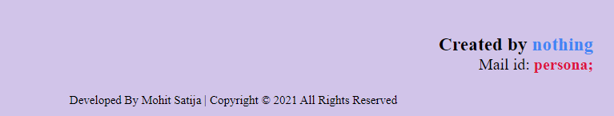

# nestedforms

<h2><a href="https://nestedform.herokuapp.com/">click here to see NestedForms</a></h2>

<h3>Home Page</h3>

<h3>Create form Page</h3>

<h3>Confirmation Page</h3>

<h3>FUC url contain Unique 81 charactes</h3>

<h1>Form Filling Page</h1>

# Fixed Issues
<h1>Due to database sometime it's possible to delay in load resources. Please Wait for few moments or try again.</h1>

# Current Issues
<h3>Google Recaptcha Problem for sending mails using smtp.</h3>

# **New**

<h3>Login/signup Page Updated</h3>

<h3>Added UserAccessPage to keep track of created forms and their responses.(Login Required)</h3>

CopyRight &copy; 2021 <a href="https://nestedform.herokuapp.com/">NestedForms.com</a>
